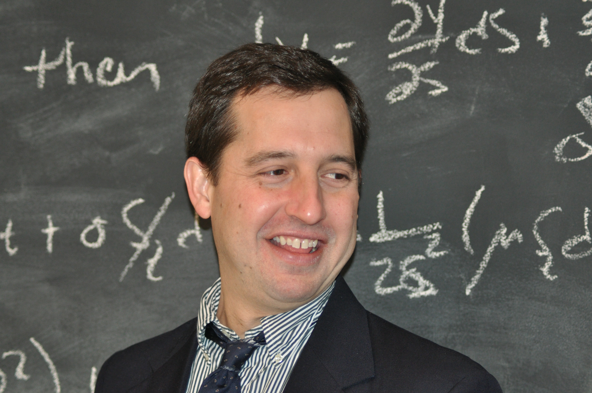

I am a Professor of Finance and Chair of the Accounting and Finance Department at the [SUNY Polytechnic Institute](https://sunypoly.edu/).   You can find [my published research work on Google Scholar](https://scholar.google.com/citations?user=CvW8NYUAAAAJ&hl=en), and by my [ORCID researcher identifier](https://orcid.org/0000-0003-1937-2712).  My CV is also available above.

The *Working Paper* link above lists much of my work in progress.  Much of my present work is on topics related to the 2023 Regional Banking crisis. I also have recently published research on crypto and electricity powers swaps.

If you are interested in teaching materials, see [this financial education site](https://financial-education.github.io).  The site contains links to interactive lecture notes.

<a itemprop="sameAs" content="https://orcid.org/0000-0003-1937-2712" href="https://orcid.org/0000-0003-1937-2712" target="orcid.widget" rel="me noopener noreferrer" style="vertical-align:top;">https://orcid.org/0000-0003-1937-2712</a>

